# spark-app-template-project

Maven template project for coding Spark Apps using Scala/Java that can be deployed to the following runtimes. Using this template, you can develop the spark code for any of the following target platforms/runtimes.

## Open the Project

1. Clone (or download) from https://github.com/yaravind/spark-app-template-project: `git clone https://github.com/yaravind/spark-app-template-project.git`.
2. Open the IntelliJ IDE.
3. Select `Open` from the Welcome dialog.
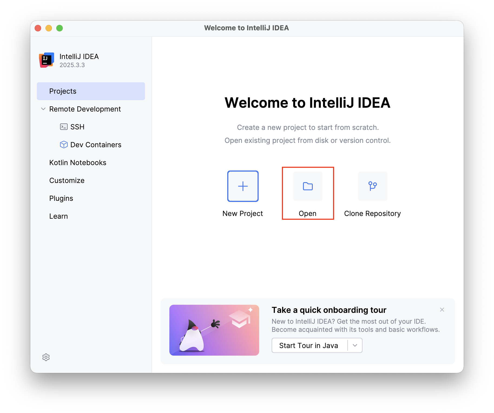
4. Select `pom.xml` from the folder where you have cloned (step 1).
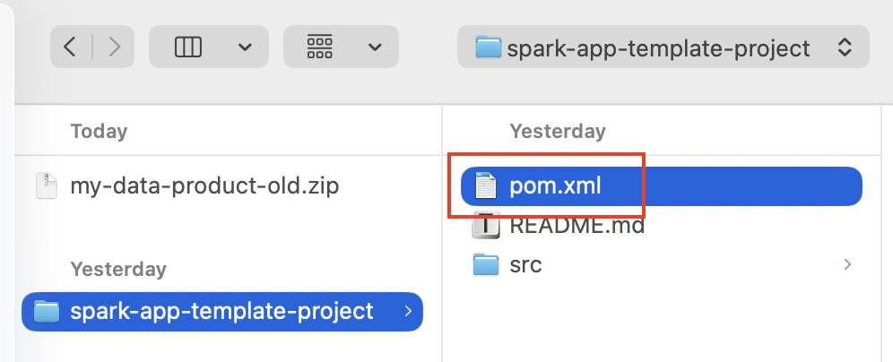
5. Select `Open as Project`.
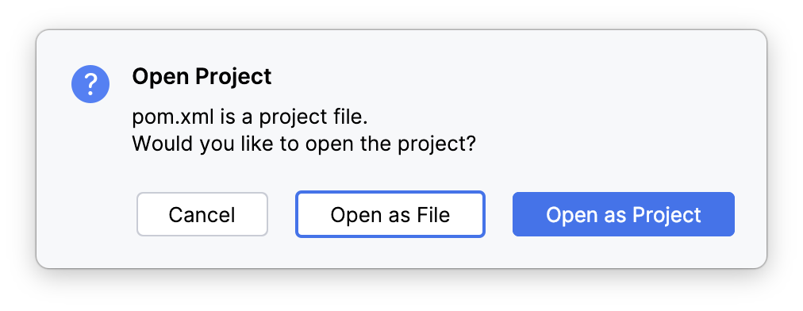
6. Click `Setup Scala SDK`. You need to set up the SDK once per project.
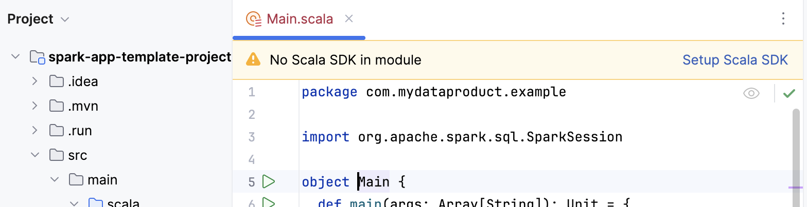
7. Select the Scala version: `2.12.17` or `2.12.18`.
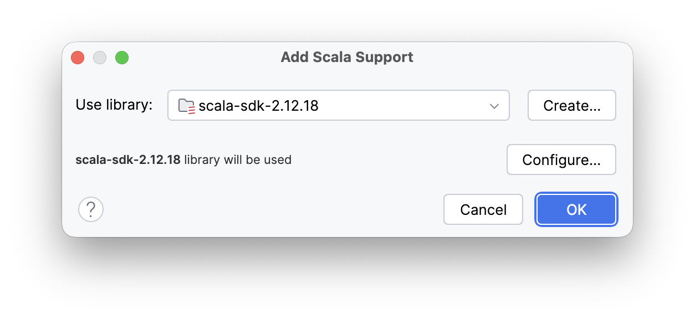

You are all set. It will take few minutes for the IDE to download all required dependencies to build and run the project.

## Run Spark Apps

### IDE

#### Run Spark App

The production code is placed under `src\main\scala` as a standard convention. Open `src/main/scala/com/mydataproduct/example/Main.scala` and click on one of the Run icons shown in the following diagram.
It invokes the Spark App's **entry point**. A Spark App has to define an entry point that gets invoked to run custom logic.
This is how the Spark transfers control to your application. It is the `main()` method in Scala/Java or Python.
Read this article [Beyond the Notebook: Embracing Engineering Rigor in Spark Development](https://medium.com/@yaravind/beyond-the-notebook-embracing-engineering-rigor-in-spark-development-beb7134652e8) for more details.

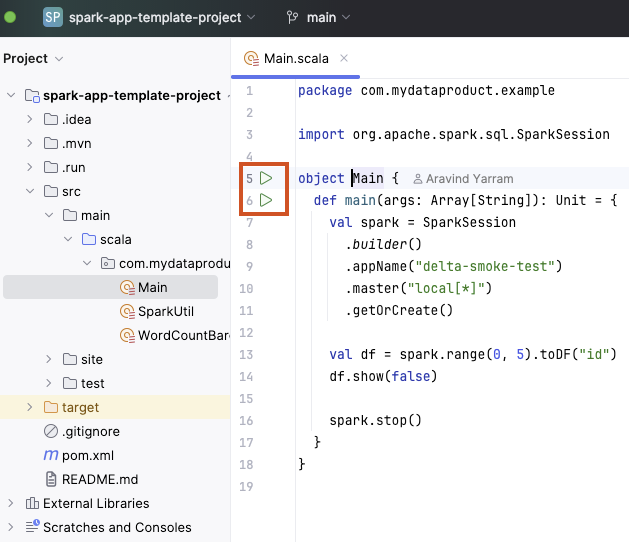

You will see the following exception when you ran it.

```console
Exception in thread "main" java.lang.NoClassDefFoundError: org/apache/spark/sql/SparkSession$
	at com.mydataproduct.example.WordCountBareDFApp$.main(WordCountBareDFApp.scala:12)
	at com.mydataproduct.example.WordCountBareDFApp.main(WordCountBareDFApp.scala)
Caused by: java.lang.ClassNotFoundException: org.apache.spark.sql.SparkSession$
	at java.base/jdk.internal.loader.BuiltinClassLoader.loadClass(BuiltinClassLoader.java:581)
	at java.base/jdk.internal.loader.ClassLoaders$AppClassLoader.loadClass(ClassLoaders.java:178)
	at java.base/java.lang.ClassLoader.loadClass(ClassLoader.java:527)
	... 2 more
```

**Problem**

The error happens because `provided` scope dependencies are excluded from the classpath at runtime. When you run the app locally, the IDE mimics a real run but respects the `provided` scope (as specified in the `pom.xml` file where dependencies are managed), so it leaves Spark out of the classpath, causing the "NoClassDefFoundError".

**Solution**

The fix is a single checkbox in IntelliJ IDEA’s Run Configurations.

Step-by-Step Fix:

1. Open the Run Configuration from the menu `Run -> Edit Configurations...` or (click the dropdown next to the green Play button top right of the IDE).
   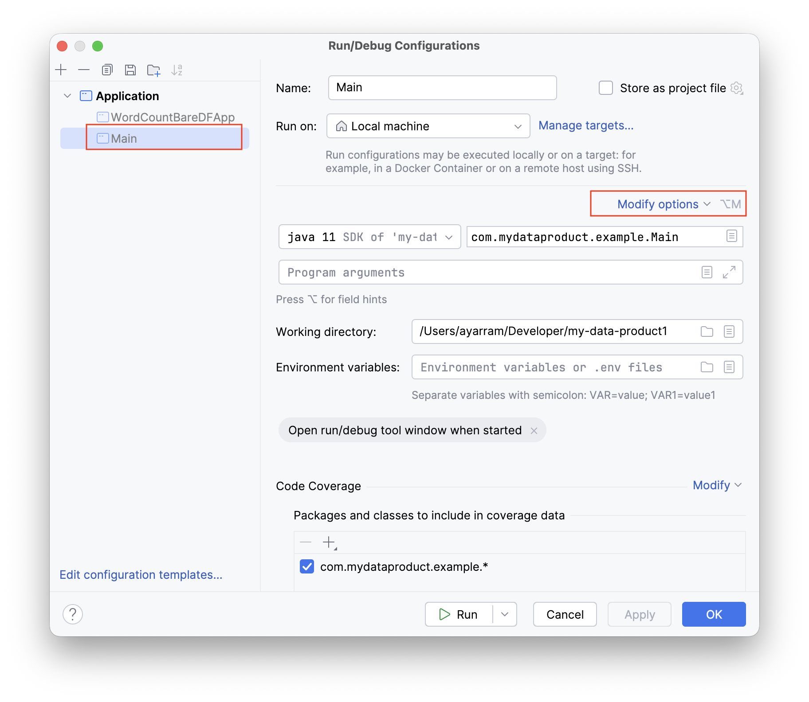
2. Select `Main` from Application configuration on the left.
   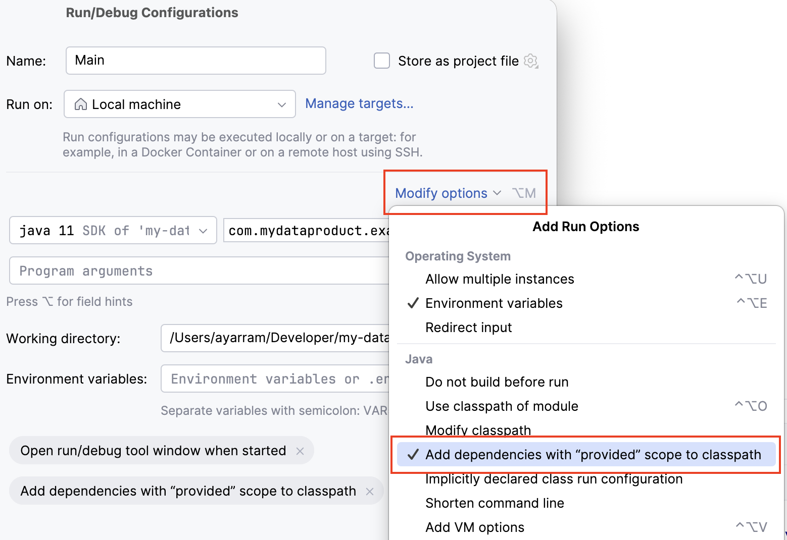
3. Look for the checkbox: "Add dependencies with 'Provided' scope to classpath".
4. Check it and click OK.
5. Run your app again. It will now work without errors.

Pro-Tip: Instead of everyone on your team fixing this manually, you can save this configuration as a file:

1. In the same Run Configuration window, check the box `Store as project file`.
2. Click on the Gear icon beside `Store as project file` amd save it in the `.run/` folder at your project root.
3. Commit this .xml file to Git.

Now, when your teammates pull the code, IntelliJ will automatically have the correct "provided" scope setting for them! 🚀

#### Run Unit Test

The unit and integrations tests are placed under `src\test\scala` as a standard convention. Open `src/test/scala/com/mydataproduct/example/DeltaSmokeTest.scala` and run the test by clicking the play button as shown below.

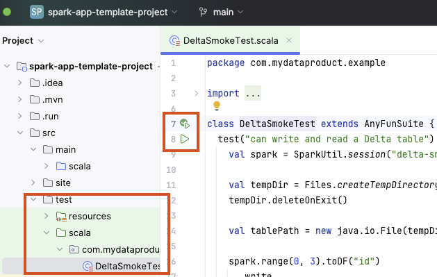

## Build Project

You can build the JAR file for any of the following target platforms/runtimes by using the `runtime` property. For e.g., `mvn -Druntime=fabric20 package` builds the jar file that is ready to be deployed to [Fabric Runtime 2.0](https://learn.microsoft.com/en-us/fabric/data-engineering/runtime-2-0). By default, the runtime is set to `fabric13`.

> NOTE: Currently, This project is only tested for Fabric 1.3 runtime.

| `-Druntime=`    | Compatible versions                                 |
| --------------- | --------------------------------------------------- |
| `fabric13`      | Spark 3.5.5 / Delta 3.2.0 / Scala 2.12.18 / Java 11 |
| `fabric20`      | Spark 4.0.0 / Delta 4.0.0 / Scala 2.13.16 / Java 21 |
| `databricks180` | Spark 4.0.0 / Delta 4.0.1 / Scala 2.13.16 / Java 21 |
| `synapse34`     | Spark 3.4.1 / Delta 2.4.0 / Scala 2.12.17 / Java 11 |

### IDE

1. Select the Maven icon from the right panel.
2. Select `install` under the `Lifecycle`
3. Click the `Run\Play` button.
4. It will compile, test and build the Uber JAR `spark-app-template-project-1.0.0-SNAPSHOT-all.jar` under `target` folder.

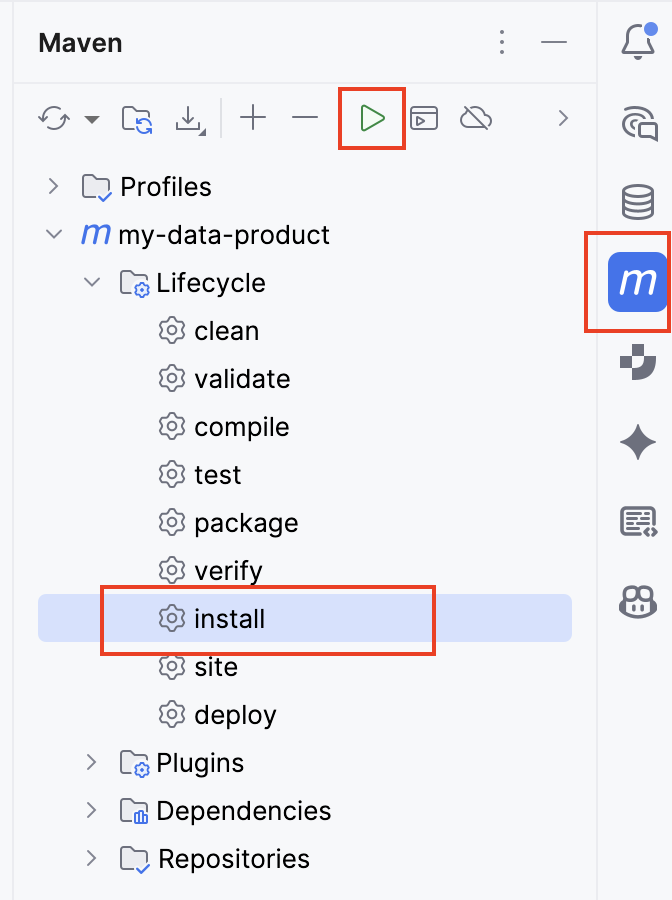

### Command-line

If you are a command-line warrior, then [install Maven](https://maven.apache.org/install.html) and use the following commands to

- Compile: `mvn clean compile`
- Run Spark App: `mvn scala:run -DmainClass="com.mydataproduct.example.WordCountBareDFApp"`
- Run all tests: `mvn test`
- Run a single test:
  `mvn scalatest:test -DwildcardSuites=com.mydataproduct.example.DeltaSmokeTest -DtestName="can write and read a Delta table"`
- Build Uber jar (to be deployed to Fabric Runtime 1.3 as SJD): `mvn clean package`
- Skip Tests: `mvn install -DskipTests`
- all: `mvn clean install`
- Build Uber jar for Fabric Runtime 2.0: `mvn clean package -Druntime=fabric20`
- Build Uber jar for Databricks RTS 18.0: `mvn clean package -Druntime=databricks180`

### Successful Build

A successful build should show something like the following

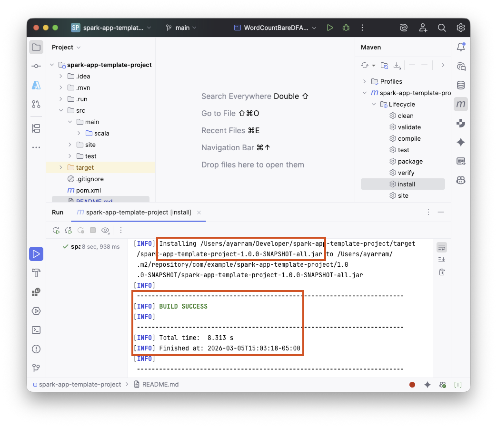